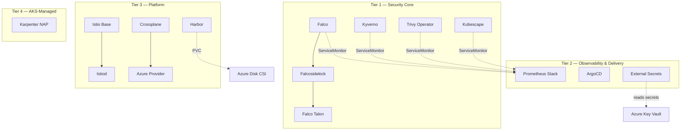

<!-- ABOUTME: Dependency graph and install order for all tools in the architecture. -->
<!-- ABOUTME: Documents tier sequencing, inter-tool dependencies, and upgrade considerations. -->

# Install Order & Dependencies

This document defines the tiered installation sequence for all tools in the
AKS Regulated Enterprise architecture. Tools are grouped into tiers based on
their role and dependency relationships. Each tier must be fully operational
before the next tier begins, because later tiers depend on CRDs, webhooks,
or services established by earlier ones. Installing out of order will cause
helm failures, webhook timeouts, or missing metrics pipelines.

## Dependency Graph

## Install Sequence

### Tier 1: Security Core (no dependencies)

| Order | Tool | Depends On | Wait For |
|-------|------|-----------|----------|
| 1.1 | Falco | — | DaemonSet Running on all nodes |
| 1.2 | Falcosidekick | Falco | Deployment Ready |
| 1.3 | Falco Talon | Falcosidekick | Deployment Ready |
| 1.4 | Kyverno | — | Admission webhook registered |
| 1.5 | Trivy Operator | — | Operator pod Running |
| 1.6 | Kubescape | — | Operator pod Running |

Within Tier 1, the Falco chain (Falco -> Falcosidekick -> Falco Talon) is
strictly sequential. Kyverno, Trivy Operator, and Kubescape have no
inter-dependencies and can install in parallel alongside the Falco chain.

### Tier 2: Observability & Delivery (depends on Tier 1)

| Order | Tool | Depends On | Wait For |
|-------|------|-----------|----------|
| 2.1 | Prometheus Stack | Tier 1 complete | Prometheus, Grafana, Alertmanager pods Running |
| 2.2 | ArgoCD | — | Server Deployment Ready, CRDs registered |
| 2.3 | External Secrets | Azure Key Vault (Terraform) | Operator pod Running, ClusterSecretStore valid |

After Prometheus deploys, the install script patches Tier 1 tools to enable
`serviceMonitor.enabled: true`. This connects their metrics endpoints to the
Prometheus scrape configuration.

### Tier 3: Platform Services (depends on Tier 2)

| Order | Tool | Depends On | Wait For |
|-------|------|-----------|----------|
| 3.1 | Istio Base | — | CRDs registered |
| 3.2 | Istiod | Istio Base | istiod Deployment Ready |
| 3.3 | Crossplane | — | Crossplane pod Running |
| 3.4 | Azure Provider | Crossplane | Provider Healthy |
| 3.5 | Harbor | Azure Disk CSI (AKS built-in) | All 7 components Running (allow 10min) |

Istio installs in two phases: base CRDs first, then the istiod control plane.
Crossplane also installs in two phases: the core operator first, then the
Azure provider package and its ProviderConfig resource.

### Tier 4: AKS-Managed (Terraform/CLI)

| Order | Tool | Depends On | Wait For |
|-------|------|-----------|----------|
| 4.1 | Karpenter (NAP) | AKS cluster Running | `az aks update` completes, NodePool CRDs available |

Karpenter uses AKS Node Autoprovisioning (NAP), which is enabled through the
Azure CLI rather than Helm. The azurerm Terraform provider v3.x does not
support `node_provisioning_profile`; this requires v4.57 or later.

## Uninstall Order

Reverse of install:

1. **Tier 4**: Disable Karpenter NAP, remove NodePool/AKSNodeClass CRDs
2. **Tier 3**: Harbor -> Crossplane (providers then core) -> Istio (istiod then base)
3. **Tier 2**: External Secrets -> ArgoCD -> Prometheus Stack
4. **Tier 1**: Kubescape -> Trivy -> Kyverno -> Falco Talon -> Falcosidekick -> Falco

## Upgrade Considerations

- **Prometheus Stack**: Upgrades may include CRD changes -- always run `helm diff` first.
- **Kyverno**: Major version upgrades may change webhook behavior -- test in staging.
- **Istio**: Follow the canary upgrade path (revision-based) for zero-downtime upgrades.
- **Crossplane**: Provider upgrades may require CRD migrations.
- **Harbor**: Database migrations run on upgrade -- backup PVCs before upgrading.
